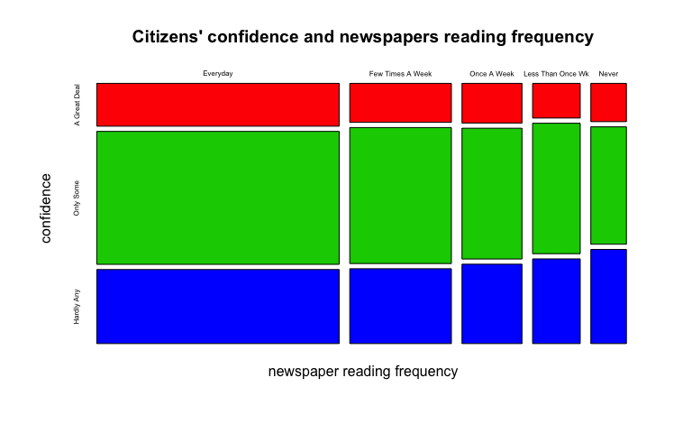
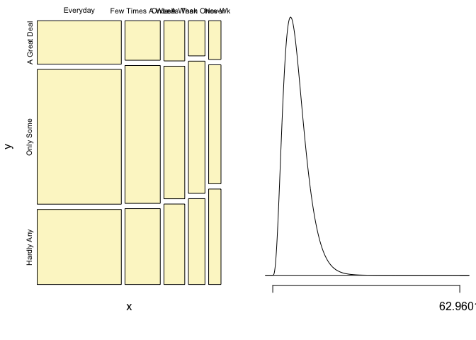

# Investigating relationship between confidence in executive branch of federal government and media exposure among American citizens
18-10-2014  

<!-- For more info on RMarkdown see http://rmarkdown.rstudio.com/ -->

<!-- Enter the code required to load your data in the space below. The data will be loaded but the line of code won't show up in your write up (echo=FALSE) in order to save space-->


<!-- In the remainder of the document, add R code chunks as needed -->

### Introduction:

In this project, we use the data from the general social survey (dataset available online [see 1]) to investigate the relationship between two variable of interest which
are frequency of reading of newspapers and the citizens' confidence in the executive branch of federal government.
We see it as an important aspect for citizens to have confidence in their government. Citizens who are confident are likely to play a role
in assisting their government to address issues of national interest. Thus we felt it necessary to study whether the citizens exposure 
to media (reading of newspapers) somehow affects the citizens' level of confidence.


### Data:


The data used in this study were collected from individual American residents. The data were collected from the survey participants through computer-assisted personal interview (CAPI), face-to-face interview and telephone interview.  

The cases are individual, non-institutionalized, English and Spanish speaking persons 18 years of age or older, living in the United States.[see 2]

The data variables that will be studied are:

1. news; type: categorical, ordinal
2. confed; type: categorical, ordinal

Our type of the study is observational. This is so because the main purpose of the general social survey is monitor and explain trends and constants in attitudes, behaviors, and attributes of the American society. The study participants are not drawn into treatment and control groups as is done in experimental studies.
Furthermore, non-random sampling is used as part of the data collection process.

The population of interest are all non-institutionalized, English and Spanish speaking persons 18 years of age or older, living in the United States. The findings of this study can be generalized to this population. This is so because though full random (probability) sampling was not used, the researchers implemented techniques to reduce the chances of bias through convenience sample.

The data can not be used to establish causal links between the two variables because the study was observational; and we can only establish correlation.

### Exploratory data analysis:

In this section, we provide some summary statistics about our variables of interest and comment on what these data suggest about our study.

Below, we provide the summaries and a contingency table for the variables.


```r
summary(gss$news)
```

```
##          Everyday  Few Times A Week       Once A Week Less Than Once Wk 
##             10412              4366              2577              2047 
##             Never 
##              1528
```

```r
summary(gss$confed)
```

```
## A Great Deal    Only Some   Hardly Any 
##         3393        11054         6483
```

```r
table(gss$confed, gss$news)
```

```
##               
##                Everyday Few Times A Week Once A Week Less Than Once Wk
##   A Great Deal     1785              681         409               284
##   Only Some        5541             2377        1349              1069
##   Hardly Any       3086             1308         819               694
##               
##                Never
##   A Great Deal   234
##   Only Some      718
##   Hardly Any     576
```

Next we show how the variables relate to each other in a mosaic plot.


```r
mosaicplot(table(gss$news, gss$confed), xlab="newspaper reading frequency", ylab="confidence", main="Citizens' confidence and newspapers reading frequency", col=c(2,3,4), cex.axis = 0.5)
```

 

From the above summary and visualiation, we see that for each confidence category, there is a decline in the
number of citizens as their freqency of reading newspapers decrease. That is the number of citizens who are confident
is higher for those who read the newspapers frequently i.e everyday and lower for those who hardly read the newspapers.

### Inference:

From the previous section, we saw some trends in the data related to our variables of interests. However,
to make any conclusions about whether the data provides sufficient evidence that these two varibles are dependent, we will perform a hypothesis test for statistical significance.

Therefore we proceed by formulating the following hypothesis.

$H_0$ (nothing is going on): Confidence in executive branch of federal government and frequency of reading newspapers are independent; Confidence do not vary by frequency of reading newspapers.

$H_A$: (something is going on):  Confidence in executive branch of federal government and frequency of reading newspapers are dependent; Confidence do vary by frequency of reading newspapers.

In our study, we are working with two categorical variable with at least two levels hence we will use the chi-square independent test. 

Now, we proceed to check conditions for this test:

- Independence: Random sampling was used for the survey and measures to control bias in other situations were deployed; the size of this sample ($n$) is less than 10% of the USA population.
- Sample size: From the summary statistics, each of the scenarios should have at least 5 expected cases.

Therefore the conditions are satisfied and we can run the hypothesis test. We use the provided $inference()$ function
for this computation.


```r
source("http://bit.ly/dasi_inference")
suppressWarnings(inference(y= gss$confed,x= gss$news,est="proportion",type="ht",null=0,alternative="greater",method="theoretical"))
```

```
## Response variable: categorical, Explanatory variable: categorical
## Chi-square test of independence
## 
## Summary statistics:
##               x
## y              Everyday Few Times A Week Once A Week Less Than Once Wk
##   A Great Deal     1785              681         409               284
##   Only Some        5541             2377        1349              1069
##   Hardly Any       3086             1308         819               694
##   Sum             10412             4366        2577              2047
##               x
## y              Never   Sum
##   A Great Deal   234  3393
##   Only Some      718 11054
##   Hardly Any     576  6483
##   Sum           1528 20930
```

```
## H_0: Response and explanatory variable are independent.
## H_A: Response and explanatory variable are dependent.
## Check conditions: expected counts
##               x
## y              Everyday Few Times A Week Once A Week Less Than Once Wk
##   A Great Deal  1687.91           707.78      417.76            331.84
##   Only Some     5499.01          2305.87     1361.02           1081.11
##   Hardly Any    3225.08          1352.35      798.22            634.05
##               x
## y               Never
##   A Great Deal 247.71
##   Only Some    807.00
##   Hardly Any   473.29
## 
## 	Pearson's Chi-squared test
## 
## data:  y_table
## X-squared = 62.96, df = 8, p-value = 1.22e-10
```

 

From the results, we obtain a very small p-value, as such we reject the null hypothesis in favor of the alternative. Indeed, the two
variables confidence in the executive branch of federal government and frequency of reading newspapers (media exposure) are
dependent. Our signicant level is 0.05.

In words, given that the two variables are independent (null hypothesis), the probability of observed or more extreme data is
1.22e-10 which is very low hence our rejection of the null hypothesis. Thus the citizens' confidence in government do vary by how often
one reads newspapers.

### Conclusion:

Our study has shown that the collected survey data provides enough evidence that American citizens' confidence in their government and frequency of reading newspapers are associated. Due to nature of the study we can not establish any causality however
our results generalize to the whole American population.

It should be noted that the confidence variable could be affected by other variables as well and in this particular study, we have
shown that access to media is one of those factors. It is interesting to further study other variables which might be associated like
income levels or ethinicity. This would be the direction of our future work. We will then be able make further generalizations to the
American population about the interaction of these variables.

# References

[1] http://bit.ly/dasi_gss_data

[2] Smith, Tom W., Michael Hout, and Peter V. Marsden. General Social Survey, 1972-2012 [Cumulative File]. ICPSR34802-v1. Storrs, CT: Roper Center for Public Opinion Research, University of Connecticut /Ann Arbor, MI: Inter-university Consortium for Political and Social Research [distributors], 2013-09-11. http://doi.org/10.3886/ICPSR34802.v1

# Appendix

Below is part of the dataset used:
```
  caseid, 	news, 			confed
    8504       Once A Week    Only Some
    8505          Everyday    Only Some
    8506          Everyday    Only Some
    8507          Everyday   Hardly Any
    8508          Everyday    Only Some
    8509       Once A Week    Only Some
    8510          Everyday    Only Some
    8511          Everyday A Great Deal
    8512          Everyday   Hardly Any
    8513          Everyday    Only Some
    8514          Everyday    Only Some
    8515          Everyday    Only Some
    8516          Everyday A Great Deal
    8517  Few Times A Week A Great Deal
    8518 Less Than Once Wk A Great Deal
    8519          Everyday A Great Deal
    8520          Everyday    Only Some
    8521             Never    Only Some
    8522          Everyday A Great Deal
    8523          Everyday    Only Some
    8524          Everyday   Hardly Any
    8525          Everyday    Only Some
    8526          Everyday A Great Deal
    8527          Everyday    Only Some
    8528          Everyday A Great Deal
    8529          Everyday   Hardly Any
    8530  Few Times A Week    Only Some
    8531          Everyday    Only Some
    8532 Less Than Once Wk A Great Deal
    8533  Few Times A Week    Only Some
    8534          Everyday    Only Some
    8535          Everyday A Great Deal
    8536          Everyday    Only Some
    8537          Everyday A Great Deal
    8538          Everyday A Great Deal
    8539  Few Times A Week A Great Deal
    8540          Everyday    Only Some
    8541          Everyday    Only Some
    8542          Everyday    Only Some
    8543          Everyday   Hardly Any
    8544          Everyday    Only Some
    8545 Less Than Once Wk   Hardly Any
```
